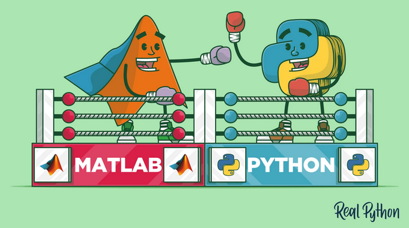

# Text mining to discover methodological trends (cooler name pending)

By Kendra Oudyk (she/her)

## Introduction to me
- I'm a PhD student in neuroscience at McGill, and I'm in the lab of JB Poline. Last year I was a rotation student, so this is my first year in my lab.
- I have BMus in Music Cognition and a Performance Diploma (piano) from McMaster University, and a Masters of Music, Mind, and Technology from the University of Jyv&auml;skyl&auml; in Finland. Yes, [Finland does exist](https://theculturetrip.com/europe/finland/articles/does-finland-exist-many-dont-think-so/).
- I became interested in open science during my masters. I was analyzing some fMRI data when I made a freaky/fascinating discovery: when I tried different methods, I got different results. This began my interest in methods and reproducibility in fMRI.
- My PhD project is looking at the biases introduced by methodological trends in neuroimaging. This project will involve some text mining, and I'd like to use the BrainHack School project as an opportunity to practice some skills I'll need.
- I'm Canadian with Dutch roots. I'm a trail runner, pianist, mediocre swing dancer, and (secretly) aspiring astronaut.

### Technical experience
- I audited the NDS course last year. I'm familiar with (but DEFINITELY not an expert in)
  - Python
  - Docker, virtual environments
  - Bash
  - Git/Github
- I want to learn
  - Software testing
  - Packaging
  - XML

## Project definition

### Background

Researchers are becoming more aware of reproduciblity issues in neuroimaging. Many are advocating for open-science practices, hoping that our research will be more reproducible if we share more components of the research process.

One way to make analyses more reproducible is to automate them using code, and to share the code openly. However, to do this, many researchers would have to commit to learning community-driven tools and programming languages. In order to convince researchers to undertake this challenge, it would be helpful to demonstrate that open tools are being adopted by other researchers, and that it wasn't detrimental to their careers to do so.

### Purpose

The purpose of this project is to look at trends in the use of open versus proprietary programming languages. Specifically, the goal is to make a simple Python package comparing the use of Python versus Matlab over time in neuroimaging papers, and the citation counts for those papers.

### Rough methods

Here's a rough outline of what the package would do
- Search for open-access articles using PubMed E-utilities, using user input (e.g., "language AND fMRI")
- Within each article,
  - Search for "Python" and "Matlab"
  - If one or the other is found, store which one, the citation count, and other meta-data
- Visualize
  - The use of Python versus Matlab over time
  - The citation counts of papers using Python versus Matlab over time

Image from [https://realpython.com/matlab-vs-python/](https://realpython.com/matlab-vs-python/)

### Skills
- API interaction
- Text mining
- Data visualization
- Python packaging
- Software testing

### Tools
- [PubMed E-utilities](https://www.ncbi.nlm.nih.gov/books/NBK25501/)
- XML
- Python
- GitHub integration

### Data
- [PubMed Open Access Subset](https://www.ncbi.nlm.nih.gov/pmc/tools/openftlist/)
- [NeuroQuery data](https://github.com/neuroquery/neuroquery_data)

### Deliverables
- A Python package comparing the use of Python versus Matlab over time in academic papers, and how well those papers were cited.
- A notebook demonstrating how to use the package, focusing on the subfields of neuroimaging.

### Other possibilities to explore
- word2vec, word clouds
- methodological features other than programming language (e.g., analysis software, whether data was shared, etc.)
